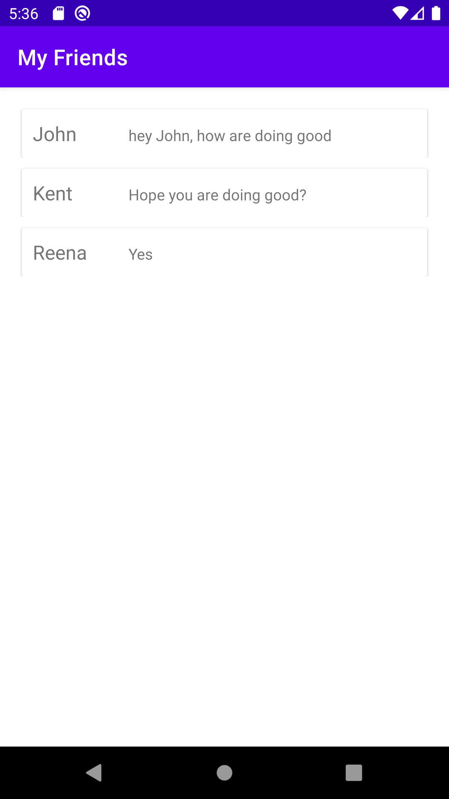
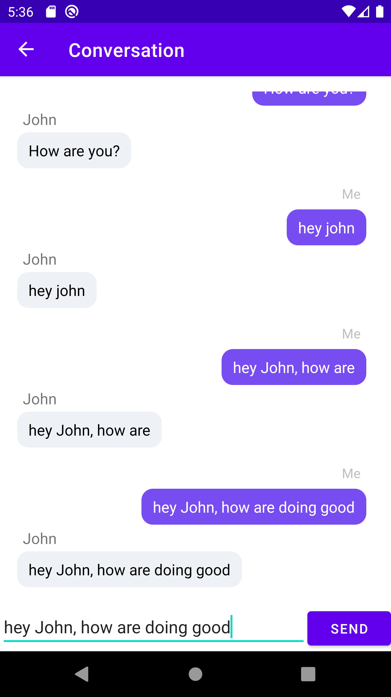
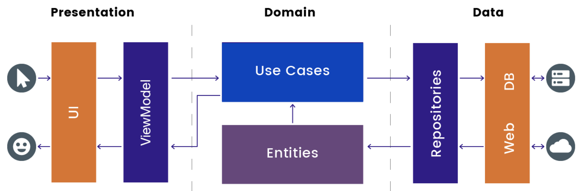

# Messaging App

## Overview

This application has following features

* User can able see to list friends with recent chats
* User can click and goto conversation page and can type new message and that message will appear in both sender and receiver text

Used single activity to handle application features

1. MessageActivity - Holds the list of albums and display to the user
3. MessageViewModel - Mediator between domain/data layer and UI layer to hold the data which suppose to
   load and display on the screen

### Artifact

## Programming Language

- Kotlin
- XML

## Development Environment

1. Android Studio Arctic Fox 2020.3.1
2. JDK 11
3. Gradle Plugin Version – 7.0.0
4. Gradle Build Version – 7.0.2.bin
5. MIN Android SDK – 21
4. JUnit4 Test Framework

## Architecture Overview

Making use of Clean Architecture and MVVM to handle
1. Separation of concern
2. Making code easily testable and maintainable
3. Easy for Dependency injection

### Clean Architecture and MVVM

**Presentation Layer**
This includes applications Activities,Fragments and ViewModels, Adapters etc.

- **Views**  
  Responsible for displaying and responding to user actions. Reacts to data changes from the View
  Model.

- **View Models**  
  Responsible for exposing and preparing data to be presented by a View. Exposes observables for
  Views to react to. It should not hold any reference to any View.

**Domain Layer**
Contains all the use cases of application which holds the business actions

- **Use Cases**  
  Responsible for encapsulating a specific business action, performs integration and orchestration
  with the data layer, and mapping between entity and data models.

**Data layer**
To have 1 or multiple implementations of the Domain's interfaces and to bind the interface with the
actual implementation

- **Repositories**  
  Returns data from data source either from Remote Service or Local Storage

## Libraries Used

* Coroutines - a great way to write asynchronous code that is perfectly readable and maintainable
* Hilt - A pragmatic lightweight dependency injection framework for Kotlin developers to whom we
  will give the responsibility to instantiate the different objects of our application
* Mockito - Mocking framework for unit test cases.Mockito is used to mock interfaces so that a dummy
  functionality can be added to a mock interface that can be used in unit testing.

## Test Cases

Created test cases for following classes to validate business logic and integration of different
components and modules or layers

1. MessageViewModelTest

## Assumptions and Decisions
* There was no input box present on conversation screen so added new edittext and button to send the message
* Assumed that we already have data available and to mimic that I have added mock data initially
* Due to time constraint I focused on functionality rather than UI

